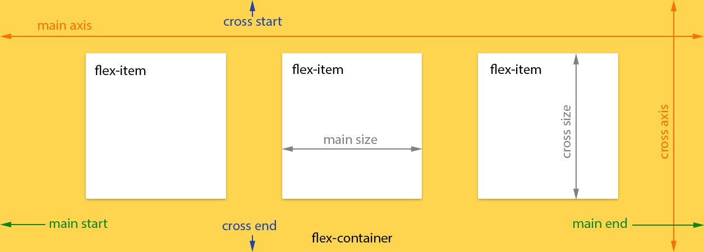

# Intro

Let's discover **ngx-Layout in less than 5 minutes**.

## Getting Started

Get started by **adding ngx-layout to your project**.

Or **try ngx-Layout immediately** with **[ngx-layout](https://ngx-layout.ngbracket.com)**.

## Layout

The @ngbracket/ngx-layout provides a sophisticated layout API using FlexBox CSS + mediaQuery. This module provides Angular developers with component layout features using a custom Layout API, mediaQuery observables, and injected DOM flexbox-2016 css stylings.

The Layout engine intelligently automates the process of applying appropriate FlexBox CSS to browser view hierarchies. This automation also addresses many of the complexities and workarounds encountered with the traditional, manual, CSS-only application of Flexbox CSS.



@ngbracket/ngx-layout is a pure-Typescript Layout engine; unlike the pure CSS-only implementations published in other Flexbox libraries and the JS+CSS implementation of AngularJS Material Layouts.

This implementation of @ngbracket/ngx-layout is independent of Angular Material.
This implementation is currently only available for Angular (v15 and higher) applications.

## Featured Demo

One of the hardest features to implement is a grid layout with specific column spans. Our online demo shows how easy this is!

Live Demo:
[Grid with column spans](https://ngx-layout.ngbracket.com/stackoverflow/grid-column-span)

```html
<div class="containerX">
  <div class="container">
    <div>flex: 1 1 5em;</div>
    <div></div>
    <div></div>
    <div></div>
  </div>
  <div class="container">
    <div></div>
    <div [fxFlex]="calc2Cols">flex: 2 2 calc(10em + 10px);</div>
    <div></div>
  </div>
  <div class="container">
    <div [fxFlex]="calc2Cols">flex: 2 2 calc(10em + 10px);</div>
    <div></div>
    <div></div>
  </div>
  <div class="container">
    <div></div>
    <div></div>
    <div [fxFlex]="calc2Cols">flex: 2 2 calc(10em + 10px);</div>
  </div>
  <div class="container">
    <div [fxFlex]="calc3Cols" class="col3">flex: 3 3 calc(15em + 20px);</div>
    <div></div>
  </div>
  <div class="container">
    <div></div>
    <div [fxFlex]="calc3Cols" class="col3">flex: 3 3 calc(15em + 20px);</div>
  </div>
</div>
```
