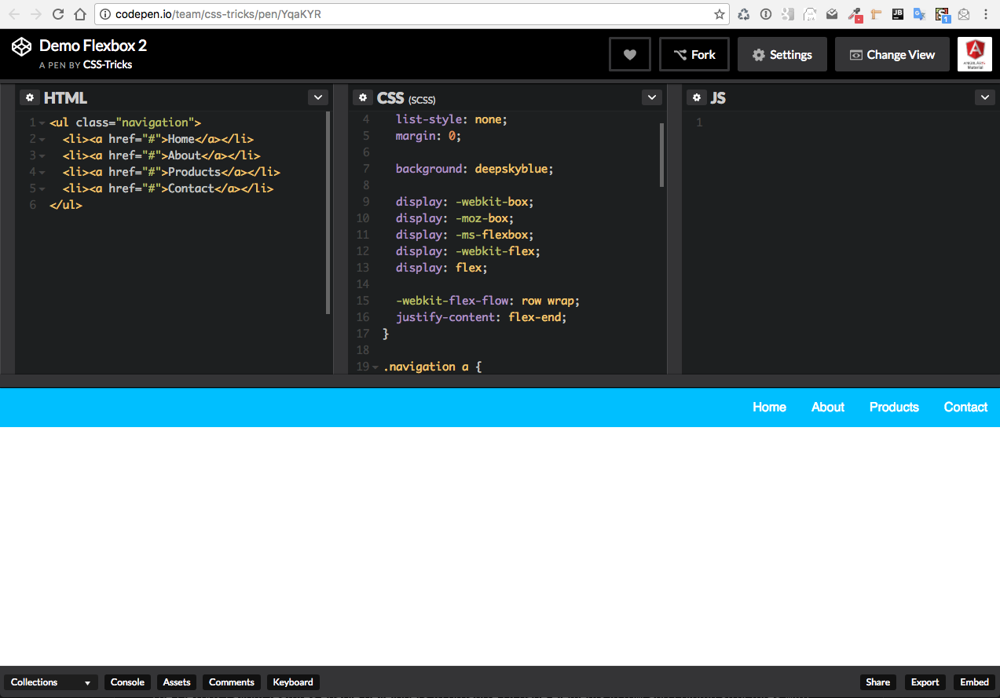

# Background

The primary idea behind the ngx-layout is to give HTML DOM elements the ability to alter their width/height (and order) to best fill the available space... to reflow and layout for different kinds of display devices and different screen sizes.

More importantly, flexbox css is direction-agnostic as opposed to the regular layouts (block which is vertically-based and inline which is horizontally-based). While those work well for some pages, they lack flexibility to support large or complex applications: especially when it comes to orientation changing, resizing, stretching, shrinking, etc. Especially important are flex features that resize elements to intelligently fill available spaces. A flex container expands items to fill available free space, or shrinks them to prevent overflow.

Now let's add these complexities the requirements that developers often want combine the CSS Flexbox API with CSS media queries in order to support responsive layouts. e.g.

These additional feature ideas - derived from real-world Application implementations - have now been implemented within the ngx-layout library. Here are some of this libraries more notable features:

- Direct DOM element CSS style injections
- Distinct responsive engine (MediaQuery change notifications with adapters)
- Subscription process for adaptive notifications to trigger custom Layout processes
